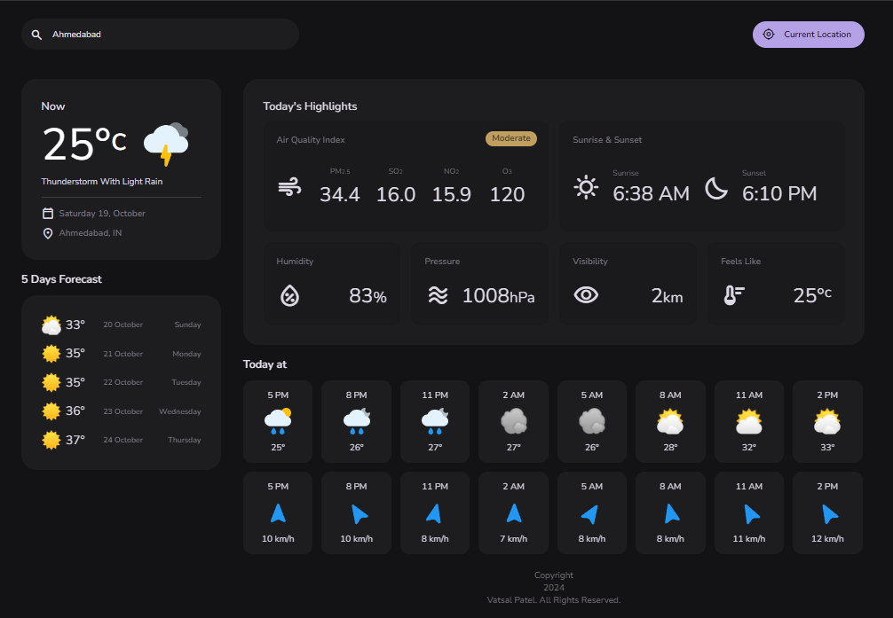

# WeatherApp

### Live Preview
[Live Website Link](https://vatsalpatel1123.github.io/WeatherApp/)

<details>
     <summary><h2>Table of Contents</h2></summary>

- [Preview](#preview)
- [Installation](#installation)
- [Usage](#usage)
- [Features](#features)
- [Technologies Used](#technologies-used)
- [Contributing](#contributing)
</details>

## Installation

To run this project locally, follow these steps:

1. **Clone the repository**

   ```sh
   git clone https://github.com/vatsalpatel1123/WeatherApp.git
   cd WeatherApp
   ```

2. **Open index.html in your web browser**

      You can either open the index.html file directly in your browser or use a local server like [Live Server](https://marketplace.visualstudio.com/items?itemName=ritwickdey.LiveServer) in VSCode to serve the files.

## Usage

1. **Grant location permission**

     Upon launching the application, it will request access to your device's location to provide weather updates. Grant the necessary permission by selecting "Allow" or "Grant Access."

2. **View current weather**

     After granting location access, the app will display the current weather details for your location, including metrics such as temperature, humidity, wind speed, and more.

3. **Search for weather updates**

    To search for the weather of another location, simply enter the city or location name in the search bar and press Enter. The app will fetch and display weather data for the specified location. The search functionality includes auto-complete suggestions to assist users in finding locations easily.

## Features

- Real-time weather updates for your current location.
- Simple and user-friendly interface for easy navigation.
- Detailed weather data, including temperature, humidity, wind speed, and more.
- Search functionality with auto-complete and location suggestions for quick weather searches.
- Seamless integration with the OpenWeather API.

## Technologies Used

<div style="display: flex; flex-wrap: wrap; gap: 5px;">
     
     
     
     
</div>

## Preview



